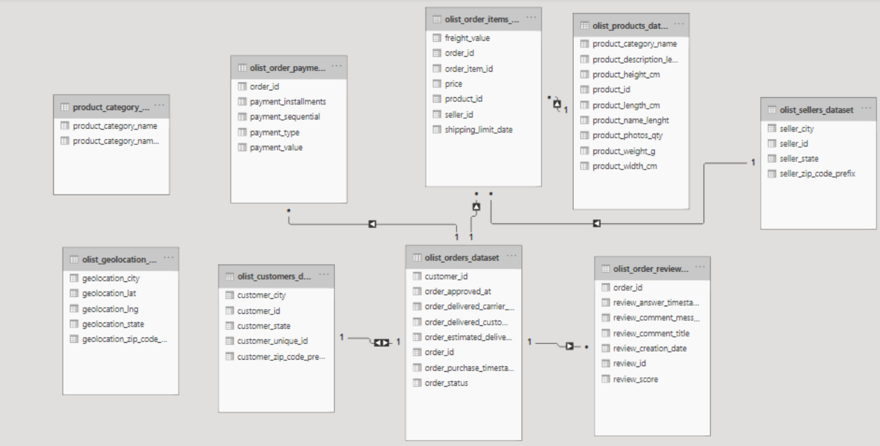
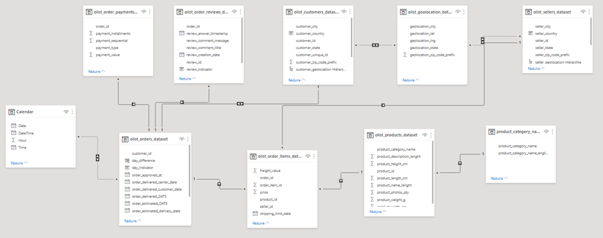
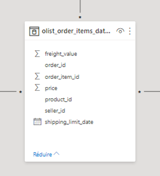
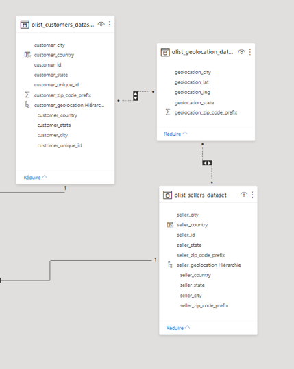
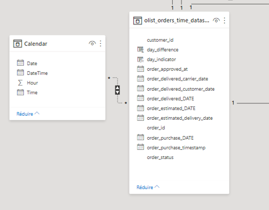
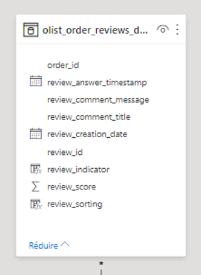
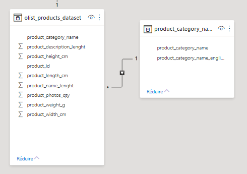

# Business Analysis On Olist Dataset

## Introduction

This repository contains the dashboards of a business analysis on the [Brazilian E-Commerce Public Dataset by Olist](https://www.kaggle.com/datasets/olistbr/brazilian-ecommerce) available on Kaggle using Power BI. The dataset presents 100K orders from 2016 to 2018 made through the Bazilian platform Olist regrouping various marketplaces. This is real commercial data presenting temporal and geographical dimensions of the orders. This project allowed to make dashboards through a Methods and Tools for Business Intelligence course at ISEP Engineering School. They were presented to and acclaimed by speakers working in the field. The objectives were to make relevant insights about the data by proposing various Key Performance Indicators and justify them through visualizations and analytics. Based on those indicators, the idea was to propose strategic decisions for businesses in order to increase profits and optimize sales depending on various factors. 

## Context

Olist was created in February 2014 working in Brazilian market to connect stores directly to customers via their online marketplace. It counts more than 9K partners and 2M customers. We took this case study because Olist represents the biggest market place in Brazil giving a good overview of sellers and customers interactions across space and time. Moreover, the dataset containing 100k is an opportunity to have well represented behaviors and allow to propose interesting strategies for the expansion of the company. Indeed, thanks to this context, it is possible to have knowledge about the most demanded products, the future sales, the comments on the products and the optimization of deliveries and services.

## Data model

Once we have downloaded the dataset from Kaggle, it is possible to load it into Power BI. The data will have to be pre-processed in order to obtain relevant analytics as it only has the tables and keys refering to each file of the dataset. At first we obtain the data model visible in the following image.

Thus, it needs to make links between tables depending on how they interact with each other. The olist_geolocation and product_category tables are not linked to the model at all which means it is not possible to leverage this data. The temporal is also not explicitely indicated as Power BI needs rigorous time management to apply it to the other tables. Moreover, the variables have a type depending on whether they are numerical or textual data. Indeed, we can see that it contains data about transportation logistics, customers, sellers and their different products each with a different type. In the end, we can see the result on the following image.

We will dive into the tables that were added or modified in order to obtain this final data model that allows us to make analytics.

## Table analysis

### Facts table

This table is at the center of the data model. It represents the most important part of the dataset describing best what can be obtained from the data. Thus, in this case, it about the orders made by a customer buying a specific product. This table contains only primary keys that are necessary to infer knowledge about the data.

### Space table

The space table is represented by olist_geolocation that is now connected to the data model in order to use the information it contains for the two other tables: olist_customer and olist_seller. Indeed, with the olist_geolocation table, we are able to create secondary keys about customers and sellers to obtain knowledge about their postal code, city or state that were previously impossible to understand. Moreover, we created a hierarchy in order to go from the country and drill down to the state then the city.

### Time table

Similarly to the space table, we created a time table named Calendar in order to have a precise temporality about the data. Thanks to this table it is possible to make knowledge about temporal data by classifying it chronologically. Thus, in the olist_orders_time table, we are able to tell the difference in days between the orders that allow to group them by day date and obtain indicators such as the deliveries or the purchases. With this, it is again possible to drill down from the year to the quarter, the month and the day.

### Reviews table

In this table, the idea was to create relevant indicators that could be analyzed to obtain insights about the products. Thus, we created the review_indicator that tells if a comment has been made after a purchase or not. It will give us knowledge on how the customers liked the product or not and if they want to share it to others. Then, the review_sorting indicator sorts the reviews according to the recurrent keywords. It will be possible to know what can describe best the products when customers have similar opinions.

### Products table

Finally, in order to have relevant information about the products, the idea is to link the table to the product_category table to obtain the translation in English of the different product categories which is more insightful.

## Dashboard pages

This README serves as an introduction to the project. Once we have the final data model, the idea is to make the relevant analytics and their intepretation to obtain strategies for the business. This analysisand the different pages are presented in the `dashboard\` folder. One is invited to go through the markdown files explaining each page describing the business analysis of Olist. This project contains the following pages:

1. **[Sellers](https://github.com/AmauryDM/olist-power-bi/blob/main/dashboard/page-1/README.md)**: Performances of each sellers
2. **[Temporal](https://github.com/AmauryDM/olist-power-bi/blob/main/dashboard/page-2/README.md)**: Temporal evolution of data
3. **[Payments](https://github.com/AmauryDM/olist-power-bi/blob/main/dashboard/page-3/README.md)**: Buyers' behaviour
4. **[Products](https://github.com/AmauryDM/olist-power-bi/blob/main/dashboard/page-4/README.md)**: Products insights
5. **[Returns](https://github.com/AmauryDM/olist-power-bi/blob/main/dashboard/page-5/README.md)**: Returns analysis
